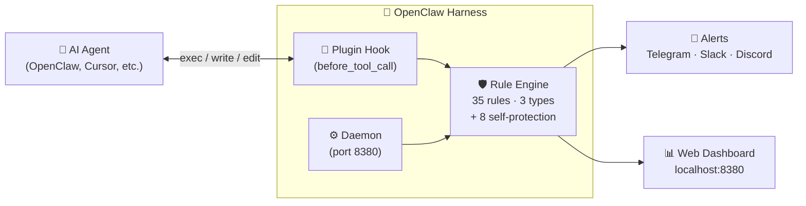

<div align="center">

# 🛡️ OpenClaw Harness

**Security harness + AI Behavior Brain for OpenClaw and coding agents — block threats *and* understand your workflows.**

[](https://rustup.rs/)
[](LICENSE)
[](https://github.com/sparkishy/openclaw-harness)

[Quick Start](#-quick-start) · [Why](#-why) · [Features](#-features) · [🧠 AI Behavior Brain](#-ai-behavior-brain) · [Rules](#-rules) · [Architecture](#-architecture) · [OpenClaw Plugin](#-openclaw-plugin) · [Contributing](#-contributing)

</div>

---

## 🔥 Why

An OpenClaw session [executed arbitrary commands](https://github.com/sparkishy/openclaw-harness/issues/1) that modified system files and exfiltrated data — a textbook RCE via AI agent. The agent had full shell access with no guardrails.

**AI coding agents are powerful. They're also unsupervised shells unless you add guardrails.**

OpenClaw Harness sits between the agent and your system. Dangerous `exec`, `write`, and `edit` calls can be checked and blocked **before execution**, while the daemon keeps an audit trail and builds workflow intelligence from your agent activity.

---

## 🚀 Quick Start

### Install from source

```bash
git clone https://github.com/sparkishy/openclaw-harness.git
cd openclaw-harness
cargo build --release
```

### Run

```bash
# Start the daemon (foreground mode for first run)
./target/release/openclaw-harness start --foreground

# Or install globally
cargo install --path .
openclaw-harness start --foreground
```

The web dashboard is available at **http://localhost:8380**.

### Storage location (external drive / formac)

By default, brain outputs and recommended DB location use external storage on **formac**:

- Brain artifacts: `/Volumes/formac/proj/safebot-data/ontology/...`
- Recommended DB path: `/Volumes/formac/proj/safebot-data/openclaw-harness.db`

You can override with environment variable:

```bash
export SAFEBOT_DATA_DIR="/Volumes/formac/proj/safebot-data"
```

#### Fallback strategy when external drive is not mounted

If `/Volumes/formac` is not mounted, brain/report persistence can fail.
Use this fallback before starting harness:

```bash
# 1) Detect mount
if [ ! -d /Volumes/formac/proj/safebot-data ]; then
  echo "formac not mounted; using local fallback"
  export SAFEBOT_DATA_DIR="$HOME/.openclaw-harness/fallback-data"
  mkdir -p "$SAFEBOT_DATA_DIR"
fi
```

Operational recommendation:
- Keep production/default path on `/Volumes/formac/proj/safebot-data`
- Use fallback only temporarily
- When formac is back, sync or move fallback artifacts into formac storage

### OpenClaw compatibility (current)

OpenClaw Harness is still broadly compatible with recent OpenClaw builds, but the **recommended path is the plugin + built-in hook flow**.

Use this checklist after any OpenClaw upgrade:

```bash
# 1) Confirm the active OpenClaw version
openclaw --version
openclaw status

# 2) Build harness
cargo build --release

# 3) Install or refresh the local plugin link
openclaw plugins install -l ./openclaw-plugin

# 4) Inspect plugin state
openclaw plugins inspect harness-guard

# 5) Enable it if needed
openclaw plugins enable harness-guard
```

What changed in newer OpenClaw versions:
- Recent OpenClaw builds already provide built-in `before_tool_call` support.
- That means **legacy patching is no longer the primary integration path**.
- `openclaw-harness patch openclaw --check` should be treated as a **legacy diagnostic**, not the main compatibility test.

### Patch OpenClaw (legacy only)

```bash
# Only for older OpenClaw builds that do not have built-in before_tool_call support
openclaw-harness patch openclaw

# Verify legacy patch state
openclaw-harness patch openclaw --check
```

> **Current recommendation:** prefer `openclaw plugins install` + `openclaw plugins enable` over patching.
>
> **Important:** if `patch openclaw --check` reports missing internal files on newer OpenClaw versions, that usually indicates internal layout changes in OpenClaw, not a failure of the plugin-based integration.
>
> **Practical compatibility note:** on current OpenClaw, the first thing to verify is not patch status but whether `harness-guard` is installed, enabled, and visible via `openclaw plugins inspect harness-guard`.

### Docker

```bash
docker compose up --build
# Dashboard at http://localhost:8380
```

---

## ✨ Features

| Feature | Description |
|---------|-------------|
| **Pre-execution Blocking** | Blocks dangerous commands _before_ they run via `before_tool_call` hooks |
| **25 Rule Templates** | Pre-built security scenarios — just pick a template and go |
| **3 Rule Types** | Regex, Keyword, and Template — choose your style |
| **Self-Protection** | 8 hardcoded tamper-proof rules prevent the agent from disabling the harness |
| **🧠 AI Behavior Brain** | Semantic knowledge graph of your workflows — patterns, decisions, bottlenecks |
| **API Proxy** | Transparent proxy for Anthropic/OpenAI/Gemini — inspects tool_use in streams |
| **OpenClaw Plugin** | Native plugin using `before_tool_call` — recommended integration path on current OpenClaw |
| **Real-time Alerts** | Telegram, Slack, Discord notifications on critical events |
| **Web Dashboard** | Live event stream, rule management, brain visualization at port 8380 |
| **Audit Trail** | SQLite database logs every inspected action |

---

## 🧠 AI Behavior Brain

**Your AI coding activity, visualized and understood.**

OpenClaw Harness doesn't just block threats — it *learns* from your workflows. Every tool call, file edit, and command execution is analyzed and converted into a **semantic knowledge graph** — your personal "brain" that reveals patterns, decisions, and optimization opportunities.

```
┌─────────────────────────────────────────────────────────────────┐
│                    🧠 ONTOLOGY BRAIN v2                         │
├─────────────────────────────────────────────────────────────────┤
│                                                                 │
│    ┌─────────┐         ┌──────────┐         ┌─────────┐        │
│    │  User   │────────▶│ Sessions │────────▶│  Tools  │        │
│    │  (You)  │         │  (S1,S2) │         │Exec/Edit│        │
│    └────┬────┘         └────┬─────┘         └────┬────┘        │
│         │                   │                    │             │
│         ▼                   ▼                    ▼             │
│    ┌─────────┐         ┌──────────┐         ┌─────────┐        │
│    │ Skills  │         │ Commands │         │ Projects│        │
│    │(Mastery)│         │(Actions) │         │(SafeBot)│        │
│    └─────────┘         └────┬─────┘         └─────────┘        │
│                             │                                   │
│         ┌───────────────────┼───────────────────┐              │
│         ▼                   ▼                   ▼              │
│    ┌─────────┐        ┌──────────┐       ┌──────────┐         │
│    │Patterns │        │Decisions │       │Incidents │         │
│    │(Repeat) │        │(Intent)  │       │(Risk)    │         │
│    └─────────┘        └──────────┘       └──────────┘         │
│                                                                     │
└─────────────────────────────────────────────────────────────────┘
```

### Semantic Node Types

Harness builds a knowledge graph with **11 entity types** connected by **7 relationship types**:

| Node Type | What It Represents |
|-----------|-------------------|
| `User` | You — the human operator |
| `Session` | Individual OpenClaw chat sessions |
| `Tool` | Tools used: Exec, Write, Read, Edit, WebSearch, etc. |
| `Command` | Specific shell commands executed |
| `File` | Files touched during sessions |
| `Project` | Projects worked on (derived from paths) |
| `Incident` | Security events (Warning/Critical) |
| `TaskPattern` | Commands repeated 3+ times |
| `Decision` | Intent-detected actions (fix/refactor/deploy/etc) |
| `Bottleneck` | Risk-heavy commands (2+ incidents) |
| `Skill` | Tool mastery scores (usage - risk hits) |

### Insights You Get

```bash
# Build your brain from action history
curl -X POST http://127.0.0.1:8380/api/brain/ontology/v2/build

# Query your top productivity bottlenecks
curl -X POST http://127.0.0.1:8380/api/brain/query \
  -d '{"query_type":"top_bottlenecks","limit":5}'

# Find automation opportunities
curl -X POST http://127.0.0.1:8380/api/brain/query \
  -d '{"query_type":"automation_opportunities","limit":5}'

# Get personalized recommendations
curl -X POST http://127.0.0.1:8380/api/brain/query \
  -d '{"query_type":"recommendations","limit":3}'
```

### Weekly Reports

Generate comprehensive weekly intelligence reports:

```bash
curl -X POST http://127.0.0.1:8380/api/reports/weekly/generate \
  -d '{"week":"2026-W09"}'
```

Reports include:
- **Pattern Analysis:** What you do repeatedly
- **Decision Summary:** Key architectural choices made
- **Bottleneck Report:** Where security friction slows you down
- **Skill Development:** Which tools you're mastering
- **Automation Recommendations:** Scripts to write, guardrails to add

### Brain Dashboard

Access the interactive brain visualization at `http://localhost:8380/brain`:

- **Force-directed graph** of all nodes and relationships
- **Filter by node type** — focus on patterns, decisions, or incidents
- **Zoom & pan** through your workflow history
- **Search** for specific commands or projects
- **Time-filtered views** — see how your behavior evolves

> 💡 **Pro tip:** Run `openclaw-harness start --foreground` and leave it running. The brain continuously learns from every session, building richer insights over time.

---

## 📏 Rules

### Rule Types

1. **Regex** — Full regex power for complex patterns
2. **Keyword** — Simple string matching (`contains`, `starts_with`, `any_of`)
3. **Template** — Pre-built scenarios with parameters (recommended for most users)

### Example Rules (YAML)

```yaml
# Regex: block dangerous rm commands
- name: dangerous_rm
  match_type: regex
  pattern: 'rm\s+(-rf?|--force|--recursive)\s+[~/]'
  risk_level: critical
  action: critical_alert
  enabled: true

# Keyword: block data exfiltration via curl
- name: block_curl_upload
  match_type: keyword
  keyword:
    contains: ["curl", "--data"]
  risk_level: warning
  action: block
  enabled: true

# Template: protect a directory
- name: protect_my_docs
  match_type: template
  template: protect_path
  params:
    path: "/Users/me/Documents"
    operations: [read, write, delete]
  risk_level: critical
  action: block
  enabled: true
```

### Available Templates (25)

<details>
<summary>Click to expand all templates</summary>

| Template | Description |
|----------|-------------|
| `protect_path` | Protect specific directories from access |
| `block_hidden_files` | Block access to dotfiles and hidden directories |
| `protect_git` | Prevent destructive git operations (force push, reset) |
| `block_docker` | Block dangerous Docker commands (--privileged, host network) |
| `protect_database` | Block DROP/TRUNCATE/DELETE without WHERE |
| `prevent_exfiltration` | Block curl/wget/nc data uploads |
| `protect_secrets` | Guard API keys, tokens, and credentials |
| `block_network_scan` | Block nmap, masscan, port scanning |
| `block_reverse_shell` | Detect and block reverse shell patterns |
| `block_crypto_mining` | Block cryptocurrency miners |
| `protect_ssh` | Guard SSH keys and config |
| `block_privilege_escalation` | Block sudo, su, setuid attempts |
| `protect_cloud_credentials` | Guard AWS/GCP/Azure credentials |
| `block_dns_exfiltration` | Block DNS-based data exfiltration |
| `protect_browser_data` | Guard browser cookies, history, passwords |
| `block_keylogger` | Block keylogger-like tools |
| `protect_backup` | Guard backup files from deletion |
| `block_compiler_bomb` | Detect zip bombs and fork bombs |
| `protect_cron` | Guard crontab from modification |
| `block_kernel_module` | Block kernel module loading |
| `protect_log_files` | Prevent log file tampering |
| `block_screen_capture` | Block screenshot/screen recording tools |
| `protect_mail` | Guard mail spool and config |
| `block_firmware` | Block firmware modification tools |
| `protect_package_manager` | Guard package manager configs |

</details>

### Rule Actions

| Action | Behavior |
|--------|----------|
| `critical_alert` | Block + send alert to all channels |
| `block` | Block execution silently |
| `pause_and_ask` | Block + prompt user for confirmation |
| `alert` | Allow but send notification |
| `log_only` | Allow and log silently |

### Self-Protection Rules (8 hardcoded)

These cannot be disabled — they prevent the AI agent from tampering with the harness itself:

- Block modifications to harness config files
- Block killing the harness process
- Block unpatching the OpenClaw hook
- Block modifications to the plugin directory
- Block access to harness database
- Block disabling rules via CLI/API from the agent
- Block `chmod`/`chown` on harness files
- Block reading harness credentials

---

## 🏗️ Architecture


```mermaid
flowchart LR
    Agent["🤖 AI Agent<br/>(OpenClaw, Cursor, etc.)"]

    subgraph Harness["🦞 OpenClaw Harness"]
        Hook["🔌 Plugin Hook<br/>(before_tool_call)"]
        Daemon["⚙️ Daemon<br/>(port 8380)"]
        Engine["🛡️ Rule Engine<br/>35 rules · 3 types<br/>+ 8 self-protection"]
    end

    Alerts["🔔 Alerts<br/>Telegram · Slack · Discord"]
    Dashboard["📊 Web Dashboard<br/>localhost:8380"]

    Agent <-->|exec / write / edit| Hook
    Hook --> Engine
    Daemon --> Engine
    Engine --> Alerts
    Engine --> Dashboard
```

### Two Operating Modes

1. **Plugin Hook** (recommended) — Uses OpenClaw's built-in `before_tool_call` plugin hook. Commands are checked and blocked synchronously before execution.

2. **API Proxy** — Transparent proxy between agent and AI provider. Inspects `tool_use` responses in the stream and strips dangerous calls.

3. **Legacy patching** — Older compatibility path for OpenClaw builds that predate built-in hook support. Keep only for backward compatibility.

### Tech Stack

- **Backend:** Rust (tokio, axum, rusqlite)
- **Frontend:** React + Vite + TailwindCSS
- **Database:** SQLite (audit trail)
- **Config:** YAML rules + YAML config

---

## 🔌 OpenClaw Plugin

```bash
# Install the plugin from this repo
openclaw plugins install -l ./openclaw-plugin

# Check the plugin record
openclaw plugins inspect harness-guard

# Enable it if disabled
openclaw plugins enable harness-guard
```

The plugin works in **Standalone** mode (built-in rules only, no daemon needed) or **Connected** mode (full features when daemon is running on port 8380). See [`openclaw-plugin/README.md`](openclaw-plugin/README.md) for details.

### Plugin health checks

After install/update, run:

```bash
openclaw status
openclaw plugins inspect harness-guard
```

Healthy state should show:
- no warning that `plugins.entries.harness-guard` is disabled
- the plugin installed from your local repo path
- the plugin enabled in config

If `openclaw status` warns that `harness-guard` is disabled, run:

```bash
openclaw plugins enable harness-guard
```

---

## ⚙️ Configuration

Default config lives at `~/.openclaw-harness/config.yaml`:

```yaml
collectors:
  openclaw: true

alerts:
  telegram:
    enabled: true
    bot_token: "${TELEGRAM_BOT_TOKEN}"
    chat_id: "${TELEGRAM_CHAT_ID}"

logging:
  level: "info"

rules:
  custom_rules_path: "~/.openclaw-harness/rules.yaml"
```

Copy the included `config/default.yaml` as a starting point:

```bash
mkdir -p ~/.openclaw-harness
cp config/default.yaml ~/.openclaw-harness/config.yaml
```

---

## 🧪 Testing

```bash
# Run tests
cargo test

# Format check (CI parity)
cargo fmt -- --check

# Lint
cargo clippy --all-targets -- -D warnings

# Test a specific rule
openclaw-harness test dangerous_rm "rm -rf /"
# ✅ MATCH — Risk Level: Critical

# Test in monitor-only mode
openclaw-harness start --foreground --mode monitor
```

## 🔁 Brain Operations (Daily/Weekly)

### Daily
1. Ensure daemon is running and actions are being collected.
2. Build latest semantic brain graph:

```bash
curl -X POST http://127.0.0.1:8380/api/brain/ontology/v2/build
```

3. Query insights:

```bash
curl -X POST http://127.0.0.1:8380/api/brain/query \
  -H 'Content-Type: application/json' \
  -d '{"query_type":"top_bottlenecks","limit":5}'

curl -X POST http://127.0.0.1:8380/api/brain/query \
  -H 'Content-Type: application/json' \
  -d '{"query_type":"automation_opportunities","limit":5}'

curl -X POST http://127.0.0.1:8380/api/brain/query \
  -H 'Content-Type: application/json' \
  -d '{"query_type":"recommendations","limit":3}'
```

### Weekly
1. Generate weekly report:

```bash
curl -X POST http://127.0.0.1:8380/api/reports/weekly/generate   -H 'Content-Type: application/json'   -d '{"week":"2026-W09"}'
```

2. Review:
- `ontology/v2/insights.json`
- `reports/weekly/<week>.md`
- top bottlenecks/patterns/skills/decisions


---

## 🤝 Contributing

Contributions are welcome! Here's how to get started:

1. Fork the repository
2. Create a feature branch: `git checkout -b feat/my-feature`
3. Make your changes and add tests
4. Run checks: `cargo test && cargo clippy`
5. Submit a pull request

### Development Setup

```bash
git clone https://github.com/sparkishy/openclaw-harness.git
cd openclaw-harness
cargo build

# Run in development mode
cargo run -- start --foreground

# Build the web UI (optional)
cd ui && npm install && npm run build
```

### Areas for Contribution

- New rule templates
- Additional alert channels (email, PagerDuty, etc.)
- Support for more AI agents (Cursor, Windsurf, Copilot)
- Documentation improvements
- Performance optimizations

---

## 📄 License

[Business Source License 1.1](LICENSE) — free for non-production use. Production use requires a commercial license after the change date.

---

<div align="center">

**Built because AI agents shouldn't have unsupervised root access.**

[⬆ Back to top](#️-openclaw-harness)

</div>
