<div align="center">

# 🛡️ OpenClaw Harness

**Security harness for AI coding agents — inspect, block, and audit every tool call before it executes.**

[](https://rustup.rs/)
[](LICENSE)
[](https://github.com/sparkishy/openclaw-harness)

[Quick Start](#-quick-start) · [Why](#-why) · [Features](#-features) · [Rules](#-rules) · [Architecture](#-architecture) · [OpenClaw Plugin](#-openclaw-plugin) · [Contributing](#-contributing)

</div>

---

## 🔥 Why

On January 2026, an OpenClaw (Claude Code) session [executed arbitrary commands](https://github.com/sparkishy/openclaw-harness/issues/1) that modified system files and exfiltrated data — a textbook RCE via AI agent. The agent had full shell access with no guardrails.

**AI coding agents are powerful. They're also unsupervised `root` shells.**

OpenClaw Harness sits between the agent and your system. Every `exec`, `file_write`, and `http_request` is matched against security rules — dangerous calls are **blocked before execution**.

---

## 🚀 Quick Start

### Install from source

```bash
git clone https://github.com/sparkishy/openclaw-harness.git
cd openclaw-harness
cargo build --release
```

### Run

```bash
# Start the daemon (foreground mode for first run)
./target/release/openclaw-harness start --foreground

# Or install globally
cargo install --path .
openclaw-harness start --foreground
```

The web dashboard is available at **http://localhost:8380**.

### Patch OpenClaw (recommended)

```bash
# Inject before_tool_call hook into OpenClaw's exec tool (legacy builds)
openclaw-harness patch openclaw

# Verify
openclaw-harness patch openclaw --check
```

> **Note:** OpenClaw **2026.2.x+** ships with built-in `before_tool_call` hooks, so no patch is required. `--check` will report that hooks are built-in.
>
> **Tested:** Verified with OpenClaw **2026.2.15** (latest stable at time of writing; bundled loader includes built-in `wrapToolWithBeforeToolCallHook`).
>
> **Compatibility status:** `@openclaw/harness-guard` plugin (`before_tool_call`) loads correctly on 2026.2.15. No code changes required for this release.
>
> **Version mismatch tip:** If `openclaw --version` shows an older version but `openclaw status` mentions a newer one, you likely have multiple installs (e.g., Homebrew + nvm). Ensure your PATH points to the same OpenClaw binary you upgraded.

### Docker

```bash
docker compose up --build
# Dashboard at http://localhost:8380
```

---

## ✨ Features

| Feature | Description |
|---------|-------------|
| **Pre-execution Blocking** | Blocks dangerous commands _before_ they run via `before_tool_call` hooks |
| **25 Rule Templates** | Pre-built security scenarios — just pick a template and go |
| **3 Rule Types** | Regex, Keyword, and Template — choose your style |
| **Self-Protection** | 8 hardcoded tamper-proof rules prevent the agent from disabling the harness |
| **API Proxy** | Transparent proxy for Anthropic/OpenAI/Gemini — inspects tool_use in streams |
| **OpenClaw Plugin** | Native plugin with `before_tool_call` hook — no proxy needed |
| **Real-time Alerts** | Telegram, Slack, Discord notifications on critical events |
| **Web Dashboard** | Live event stream, rule management, statistics at port 8380 |
| **Audit Trail** | SQLite database logs every inspected action |

---

## 📏 Rules

### Rule Types

1. **Regex** — Full regex power for complex patterns
2. **Keyword** — Simple string matching (`contains`, `starts_with`, `any_of`)
3. **Template** — Pre-built scenarios with parameters (recommended for most users)

### Example Rules (YAML)

```yaml
# Regex: block dangerous rm commands
- name: dangerous_rm
  match_type: regex
  pattern: 'rm\s+(-rf?|--force|--recursive)\s+[~/]'
  risk_level: critical
  action: critical_alert
  enabled: true

# Keyword: block data exfiltration via curl
- name: block_curl_upload
  match_type: keyword
  keyword:
    contains: ["curl", "--data"]
  risk_level: warning
  action: block
  enabled: true

# Template: protect a directory
- name: protect_my_docs
  match_type: template
  template: protect_path
  params:
    path: "/Users/me/Documents"
    operations: [read, write, delete]
  risk_level: critical
  action: block
  enabled: true
```

### Available Templates (25)

<details>
<summary>Click to expand all templates</summary>

| Template | Description |
|----------|-------------|
| `protect_path` | Protect specific directories from access |
| `block_hidden_files` | Block access to dotfiles and hidden directories |
| `protect_git` | Prevent destructive git operations (force push, reset) |
| `block_docker` | Block dangerous Docker commands (--privileged, host network) |
| `protect_database` | Block DROP/TRUNCATE/DELETE without WHERE |
| `prevent_exfiltration` | Block curl/wget/nc data uploads |
| `protect_secrets` | Guard API keys, tokens, and credentials |
| `block_network_scan` | Block nmap, masscan, port scanning |
| `block_reverse_shell` | Detect and block reverse shell patterns |
| `block_crypto_mining` | Block cryptocurrency miners |
| `protect_ssh` | Guard SSH keys and config |
| `block_privilege_escalation` | Block sudo, su, setuid attempts |
| `protect_cloud_credentials` | Guard AWS/GCP/Azure credentials |
| `block_dns_exfiltration` | Block DNS-based data exfiltration |
| `protect_browser_data` | Guard browser cookies, history, passwords |
| `block_keylogger` | Block keylogger-like tools |
| `protect_backup` | Guard backup files from deletion |
| `block_compiler_bomb` | Detect zip bombs and fork bombs |
| `protect_cron` | Guard crontab from modification |
| `block_kernel_module` | Block kernel module loading |
| `protect_log_files` | Prevent log file tampering |
| `block_screen_capture` | Block screenshot/screen recording tools |
| `protect_mail` | Guard mail spool and config |
| `block_firmware` | Block firmware modification tools |
| `protect_package_manager` | Guard package manager configs |

</details>

### Rule Actions

| Action | Behavior |
|--------|----------|
| `critical_alert` | Block + send alert to all channels |
| `block` | Block execution silently |
| `pause_and_ask` | Block + prompt user for confirmation |
| `alert` | Allow but send notification |
| `log_only` | Allow and log silently |

### Self-Protection Rules (8 hardcoded)

These cannot be disabled — they prevent the AI agent from tampering with the harness itself:

- Block modifications to harness config files
- Block killing the harness process
- Block unpatching the OpenClaw hook
- Block modifications to the plugin directory
- Block access to harness database
- Block disabling rules via CLI/API from the agent
- Block `chmod`/`chown` on harness files
- Block reading harness credentials

---

## 🏗️ Architecture

```mermaid
flowchart LR
    Agent["🤖 AI Agent<br/>(OpenClaw, Cursor, etc.)"]

    subgraph Harness["🦞 OpenClaw Harness"]
        Hook["🔌 Plugin Hook<br/>(before_tool_call)"]
        Daemon["⚙️ Daemon<br/>(port 8380)"]
        Engine["🛡️ Rule Engine<br/>35 rules · 3 types<br/>+ 8 self-protection"]
    end

    Alerts["🔔 Alerts<br/>Telegram · Slack · Discord"]
    Dashboard["📊 Web Dashboard<br/>localhost:8380"]

    Agent <-->|exec / write / edit| Hook
    Hook --> Engine
    Daemon --> Engine
    Engine --> Alerts
    Engine --> Dashboard
```



### Two Operating Modes

1. **Plugin Hook** (recommended) — Patches `before_tool_call` into the agent's exec tool. Commands are checked and blocked synchronously before execution.

2. **API Proxy** — Transparent proxy between agent and AI provider. Inspects `tool_use` responses in the stream and strips dangerous calls.

### Tech Stack

- **Backend:** Rust (tokio, axum, rusqlite)
- **Frontend:** React + Vite + TailwindCSS
- **Database:** SQLite (audit trail)
- **Config:** YAML rules + YAML config

---

## 🔌 OpenClaw Plugin

```bash
# Install the plugin (included in this repo)
openclaw plugins install -l ./openclaw-plugin
```

The plugin works in **Standalone** mode (built-in rules only, no daemon needed) or **Connected** mode (full features when daemon is running on port 8380). See [`openclaw-plugin/README.md`](openclaw-plugin/README.md) for details.

---

## ⚙️ Configuration

Default config lives at `~/.openclaw-harness/config.yaml`:

```yaml
collectors:
  openclaw: true

alerts:
  telegram:
    enabled: true
    bot_token: "${TELEGRAM_BOT_TOKEN}"
    chat_id: "${TELEGRAM_CHAT_ID}"

logging:
  level: "info"

rules:
  custom_rules_path: "~/.openclaw-harness/rules.yaml"
```

Copy the included `config/default.yaml` as a starting point:

```bash
mkdir -p ~/.openclaw-harness
cp config/default.yaml ~/.openclaw-harness/config.yaml
```

---

## 🧪 Testing

```bash
# Run tests
cargo test

# Test a specific rule
openclaw-harness test dangerous_rm "rm -rf /"
# ✅ MATCH — Risk Level: Critical

# Test in monitor-only mode
openclaw-harness start --foreground --mode monitor
```

---

## 🤝 Contributing

Contributions are welcome! Here's how to get started:

1. Fork the repository
2. Create a feature branch: `git checkout -b feat/my-feature`
3. Make your changes and add tests
4. Run checks: `cargo test && cargo clippy`
5. Submit a pull request

### Development Setup

```bash
git clone https://github.com/sparkishy/openclaw-harness.git
cd openclaw-harness
cargo build

# Run in development mode
cargo run -- start --foreground

# Build the web UI (optional)
cd ui && npm install && npm run build
```

### Areas for Contribution

- New rule templates
- Additional alert channels (email, PagerDuty, etc.)
- Support for more AI agents (Cursor, Windsurf, Copilot)
- Documentation improvements
- Performance optimizations

---

## 📄 License

[Business Source License 1.1](LICENSE) — free for non-production use. Production use requires a commercial license after the change date.

---

<div align="center">

**Built because AI agents shouldn't have unsupervised root access.**

[⬆ Back to top](#️-openclaw-harness)

</div>
